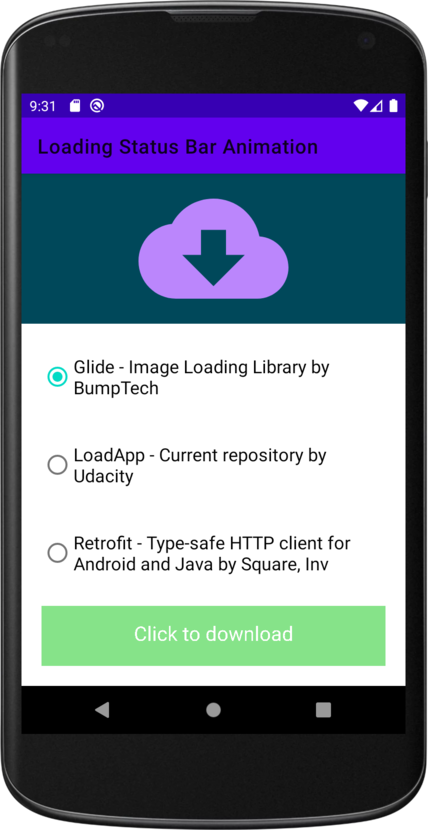

# Loading Status Bar Animation ☁️

Project created for the Udacity nanodegree Android Kotlin Developer program.

## Features ✨

- Permissions
- Notifiactions
- Animations
- Custom View
- Drawing on Canvas Objects
- Clipping Canvas Objects
- Android Property Animations
- Motion Layout

## Project Milestones

- Custom View (custom button is created by extending View)
- Animate UI elements with property animations to provide users with visual feedback in an app
- Send contextual messages using notifications to keep users informed
- Add custom functionality to the notifications
- Use declarative XML with MotionLayout to coordinate animations across multiple views

## Overview

In the app you can choose one of the radio button to decide which repository to download. To do so use a custom-built button where:

- width of the button gets animated from left to right
- text gets changed based on different states of the button
- circle gets be animated from 0 to 360 degrees

A notification will be sent once the download is complete. When a user clicks on the notification, the user lands on detail activity and the notification gets dismissed. In detail activity, the status of the download will be displayed and animated via MotionLayout upon opening the activity.

